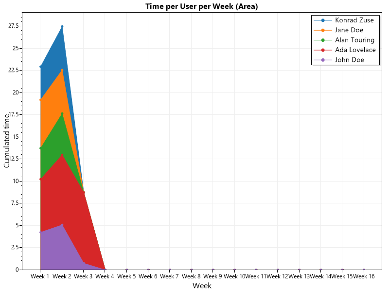
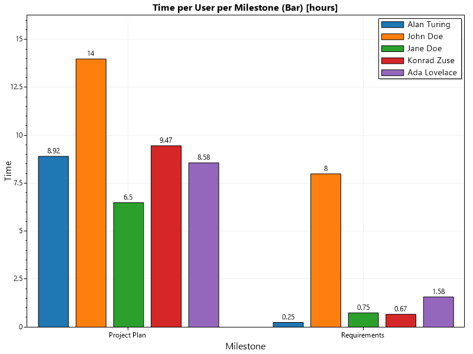
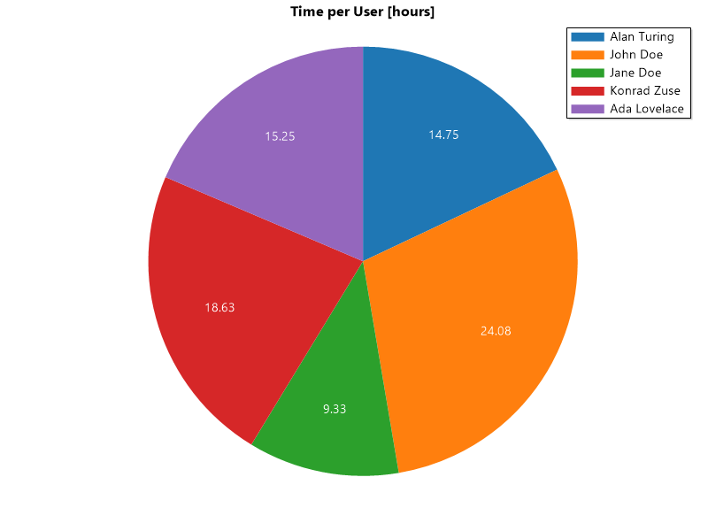

# gtt-charts

gtt-charts is a small cli application written in .NET 5 which allows the automatic creation of graphs, optionally included in a markdown file, of time tracking in gitlab.

It builds on [GitHub - kriskbx/gitlab-time-tracker: 🦊🕘 A command line interface for GitLab's time tracking feature.](https://github.com/kriskbx/gitlab-time-tracker) for getting the time tracking data from gitlab and the scripts provided in [Samuel / GitLabTimeTrackingTutorial · GitLab (hsr.ch)](https://gitlab.dev.ifs.hsr.ch/murthy10/GitLabTimeTrackingTutorial). Said scripts were altered slightly to include Labels and Milestones in the issue table.

The exported SQLite database is then loaded by gtt-charts and processed into a number of charts which are listed further down.


## Requirements

- .NET 5 for gtt-charts
- Python 3 for running the scripts to create the SQLite DB
- Node.JS for running gitlab-time-tracker


## Examples of charts







## Configuration options

gttcharts allows for extensive configuration options. A example of the configuration file can be found [here](./appsettings.json). The configuration file named *appsettings.json* needs to be in the same directory as the executable.

### List of configurations options

#### DatabasePath

Path to the SQLite database file.

**Default:** data.db

```json
	"DatabasePath": "./path/to/database.db",
```


#### IgnoreEmptyIssues

If true, issues with no time estimate will not be included in charts where issues are a dimension.

**Default:** true

```json
	"IgnoreEmptyIssues": true,
```


#### IgnoreLabels

A list of labels that should be excluded from charts in which the label(s) of an issue are a dimension. Board specific labels (e.g. To Do, Doing) can be excluded from reports with this option.

**Default:** empty

```json
    "IgnoreLabels": [
      "To Do",
      "Doing",
      "In Review",
      "Epic",
      ""
    ],
```


#### IgnoreMilestones

A list of Milestone names that should be excluded from charts in which the Milestone of an issue are a dimension. When creating a time report during a project where all milestones are already defined, unstarted milestones can excluded from reports with this option.

**Default:** empty

```json
    "IgnoreMilestones": [
      "Alpha",
      "Architecture",
      ""
    ],
```


#### IgnoreUsers

A list of User-names that should be excluded from charts in which the User of a record are a dimension. 

**Default:** empty

```json
    "IgnoreUsers": [
      "john.doe"
    ],
```


#### OutputDirectory

Path to the directory in which all output will be created.

**Default:** output

```json
    "OutputDirectory": "output",
```


#### CreateMarkdownOutput

Specified whether a markdown file containing all images should be created.

**Default:** true

```json
	"CreateMarkdownOutput": true,
```


#### MarkdownOutputName

The name of the markdown file that is to be created. This option only has an effect if ``CreateMarkdownOutput`` is set to ``true``.

**Default:** Timereport

```json
	"MarkdownOutputName": "Timereport",
```


#### MarkdownAssetFolder

Specifies whether a folder should be created in which all created charts (images) are stored. This option only has an effect if ``CreateMarkdownOutput`` is set to ``true``. The name of the asset folder will be ``MarkdownOutputName``.assets, e.g. ``Timereport.assets``.

**Default:** true

```json
	"MarkdownAssetFolder": true,
```


#### DefaultPlotHeight

Specifies the default height (in pixels) a chart should have. This is used as a fallback value when not specifying a height for a specific plot in the chart-job specific options.

**Default:** 600

```json
	"DefaultPlotHeight": 600,
```


#### DefaultPlotWidth

Specifies the default width (in pixels) a chart should have. This is used as a fallback value when not specifying a width for a specific plot in the chart-job specific options.

**Default:** 800

```json
	"DefaultPlotWidth": 800,
```


#### DefaultYScaleWidth

Specified the width (in pixels) the scale of the Y-axis will be. This is used as a fallback value when not specifying a YScaleWidth for a specific plot in the chart-job specific options.

**Default:** 20

```json
	"DefaultYScaleWidth": 20,
```


#### DefaultXScaleHeight

Specified the width (in pixels) the scale of the X-axis will be. This is used as a fallback value when not specifying a XScaleHeight for a specific plot in the chart-job specific options.

**Default:** 20

```json
	"DefaultXScaleHeight": 20,
```


#### RoundToDecimals

Specifies the number of decimal points each numeric value should be rounded to.

**Default:** 2

```json
	"RoundToDecimals": 2,
```


#### ProjectStart

Specifies the date at which the project started. This values is needed to calculate data for charts in which the week number is a dimension.

**Default:** 22.02.2021

```json
	"ProjectStart": "2021-02-22"
```


#### ProjectEnd

Specifies the date at which the project will end. This values is needed to calculate the total number of weeks which in turn is needed to create correct scale ticks.

**Default:** 10.06.2021

```json
	"ProjectEnd": "2021-06-10"
```


#### UsernameMapping

A dictionary which allows to map gitlab usernames to names of project members. 

**Default:** empty

```json
    "UsernameMapping": {
      "jane.doe": "Jane Doe",
      "john.doe": "John Doe",
      "alan.touring": "Alan Touring",
      "konrad.zuse": "Konrad Zuse",
      "ada.lovelace": "Ada Lovelace"
    },
```


#### GttChartJobOptions

This dictionary allow for the definition of chart-job specific options. A complete list of all chart-jobs and their settings is found further down in the document. The following paragraph explains the options possible for each chart-job. A JSON example of all settings is found at the bottom of this section.


##### GttChartJobOptions.Create

Specified whether a chart-job should be run and included in the final result.

**Default:** true


##### GttChartJobOptions.Title

Specified the title a chart-job produces on the image and in the markdown.


##### GttChartJobOptions.Filename

Specified the filename for the image a chart-job will produce. Don't include a file extension in this option.


#### GttChartJobOptions.PlotHeight

Specified the height (in pixels) the chart produced by this job will have.

**Default:** Value specified in ``DefaultPlotHeight``


#### GttChartJobOptions.PlotWidth

Specified the width (in pixels) the chart produced by this job will have.

**Default:** Value specified in ``DefaultPlotWidth``


#### GttChartJobOptions.YScaleWidth

Specified the width (in pixels) the Y-axis of the chart produced by this job will have. This options is important for charts that have big ticks on the scales of the axis (e.g. the PerIssue chart).

**Default:** Value specified in ``DefaultYScaleWidth``


#### GttChartJobOptions.XScaleHeight

Specified the height (in pixels) the X-axis ot the chart produced by this job will have. This options is important for charts that have big ticks on the scales of the axis (e.g. the PerIssue chart).

**Default:** Value specified in ``DefaultXScaleHeight``


#### GttChartJobOptions.XLabel

Specified the label the X-axis of the chart produced by this job will have. Set to ``null`` to hide the label.


#### GttChartJobOptions.YLabel

Specified the label the Y-axis of the chart produced by this job will have. Set to ``null`` to hide the label.


#### Complete example

```json
    "GttChartJobOptions": {
      "PerIssue": {
        "Title": "Time spent per Issue [hours]",
        "Filename": "timeSpentPerIssue",
        "PlotHeight": 1080,
        "PlotWidth": 1920,
        "YScaleWidth": 180,
        "XScaleHeight": 200,
        "YLabel": "Time in hours",
        "XLabel": "Title of the issue"
      },
      "PerLabelBar": {
        "Create": false
      }
    }
```


### List of chart-jobs and their titles

The **chart-job key** is what you need to use as the property-name under ``GttChartJobOptions`` to set the options for that specific job.

| chart-job key      | title                                                  |
| ------------------ | ------------------------------------------------------ |
| PerIssue           | Time per Issue [hours]                                 |
| PerMilestone       | Time per Milestone [hours], estimate vs. recorded time |
| PerUser            | Time per User [hours]                                  |
| PerUserPerWeekArea | Time per User per Week (Area)                          |
| PerUserPerWeekBar  | Time per User per Week (Bar)                           |
| PerLabelBar        | Time per Label (Bar), estimate vs. recorded time       |
| PerLabelPie        | Time per Label (Pie) [hours]                           |
| UserPerMilestone   | Time per User per Milestone (Bar) [hours]              |
| MilestonePerUser   | Time per Milestone per User (Bar) [hours]              |


## Building gttcharts

Clone this repo and go into the gttcharts folder which contains gttcharts.csproj

To build gttcharts, run the following command:

```powershell
dotnet build .\gttcharts.csproj
```

The binaries are now located in the default folder for your setup. In said folder, place appsettings.json that you changed according to your needs.

### Using gttcharts

1. run a .csv export in *gitlab-time-tracker*
2. run the *SQLite creation scripts* in the script folder
3. run *gttcharts*, make sure you have appropriate appsettings.json