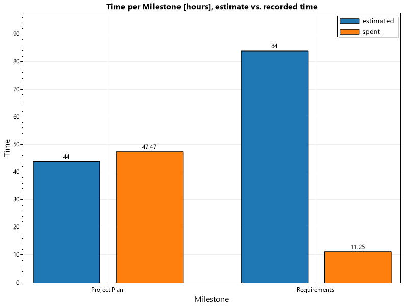
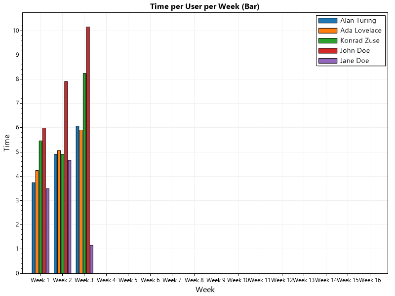
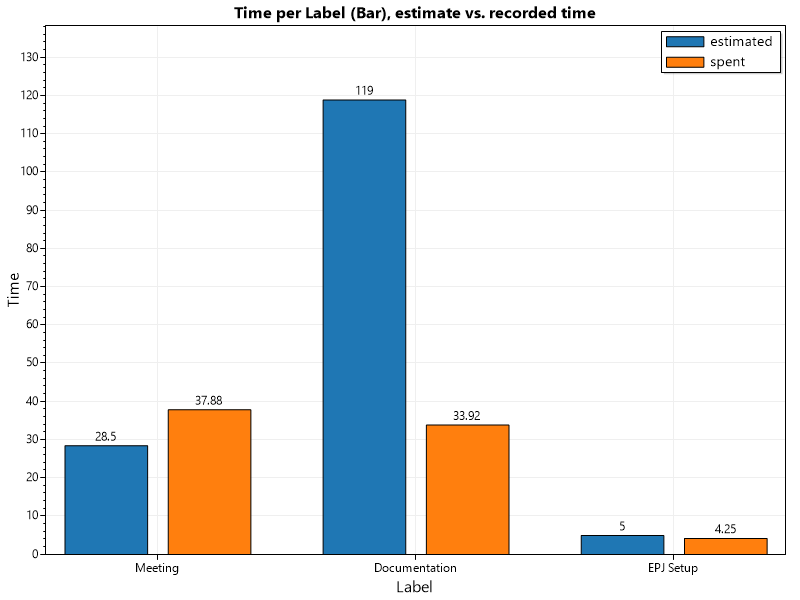
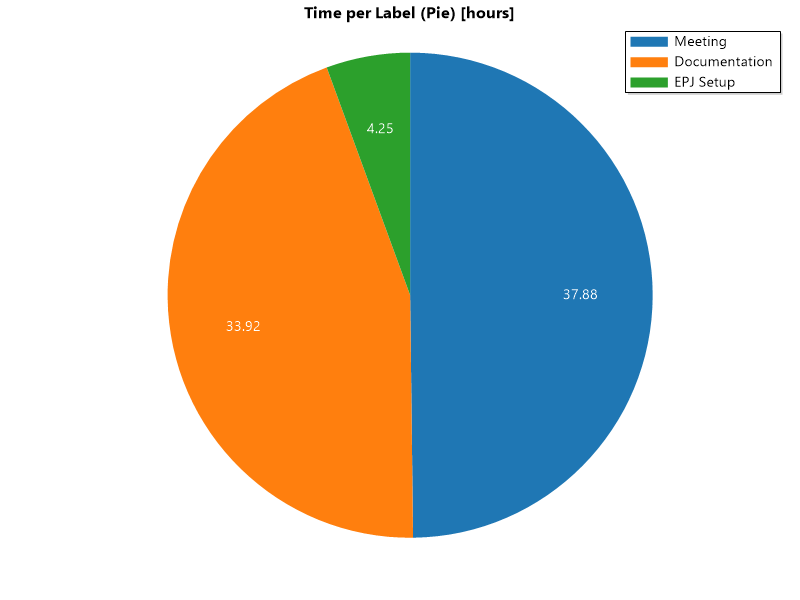
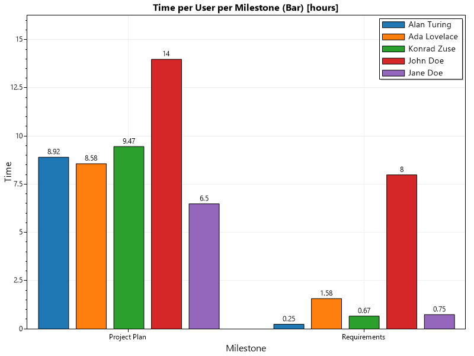
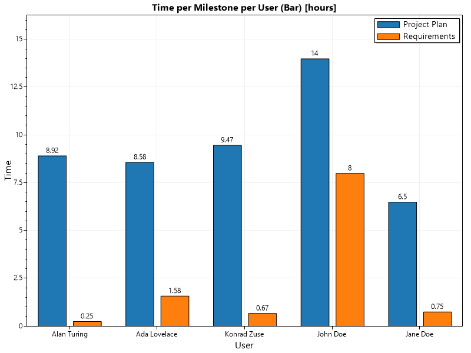

## Time per Issue [hours]

## Time per Milestone [hours], estimate vs. recorded time

## Time per User [hours]

## Time per User per Week (Area)

## Time per User per Week (Bar)

## Time per Label (Bar), estimate vs. recorded time

## Time per Label (Pie) [hours]

## Time per User per Milestone (Bar) [hours]

## Time per Milestone per User (Bar) [hours]

